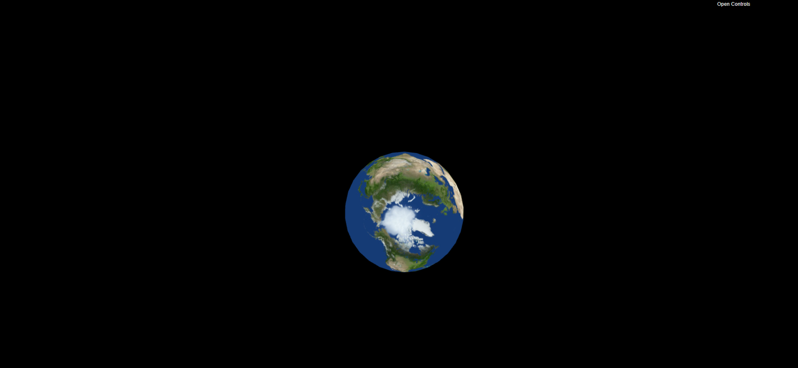
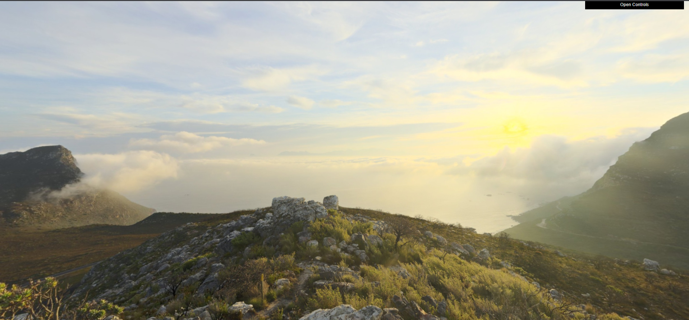
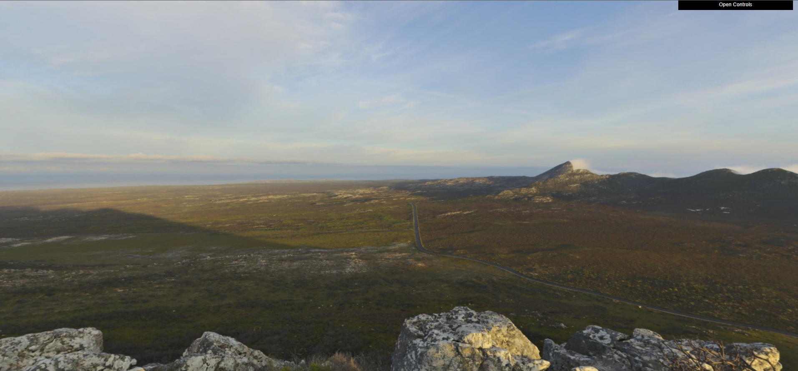
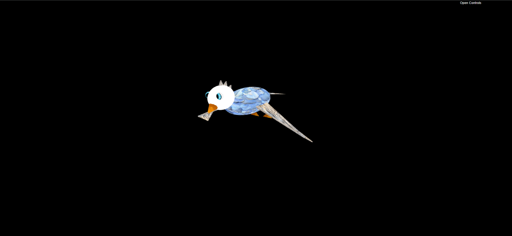
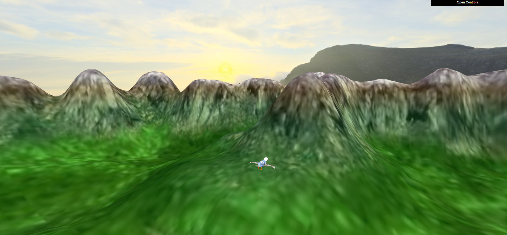
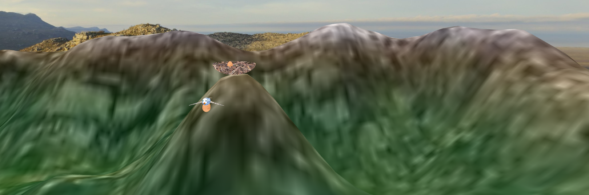
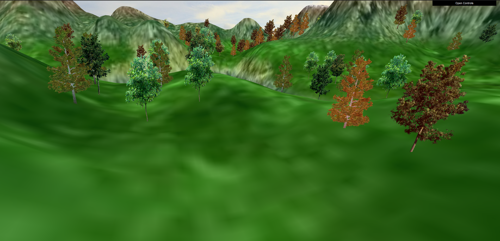
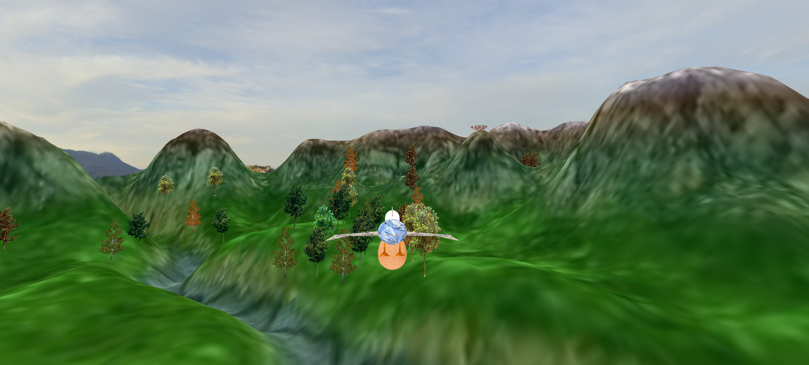

# CG PROJECT 2022/2023

## Group T06G11

| Name             | Number    | E-Mail               |
| ---------------- | --------- | -------------------- |
| Afonso Martins   | 202005900 | up202003529@fe.up.pt |
| Eduardo Silva    | 202005283 | up202005283@fe.up.pt |
| José Pinto       | 202003529 | up202003529@fe.up.pt |

----

### Notes

Sources of the additional tree textures:

- https://www.freepnglogos.com/images/tree-plan-27860.html
- https://www.pngall.com/tree-png/download/23754

### Screenshots

Screenshot 1 - Sphere

 

Screenshot 2 - Panorma view 1

 

Screenshot 2 - Panorma view 2

 

Screenshot 3 - Bird

 

Screenshot 4 - Terrain with bird and background

 

Screenshot 5 - Eggs and nest

 

Screenshot 6 - Trees

Screenshot 7 - Final

 